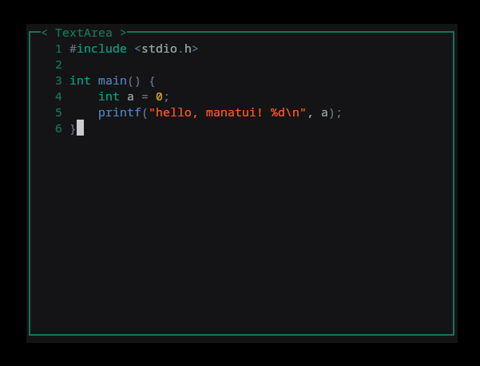

# manatui 🌊

<p align="center">
  
</p>

A lightweight, modern, and developer-friendly Terminal User Interface (TUI) framework for C, built on top of `ncurses`. 

`manatui` abstracts away the complex boilerplate of raw `ncurses`, allowing you to build rich text interfaces, custom text editors, and terminal dashboards with ease.

---

## ✨ Features

- **Component-Driven Architecture:** Easily create and manage UI elements like `TextArea`, `TextInput`, `List`, `Button`, and layouts using `Container`.
- **Advanced TextArea Component:**
  - **Syntax Highlighting:** Out-of-the-box syntax coloring for multiple languages (`C`, `Python`, `JavaScript`, `HTML`, `Odin`, `C3`, `D`, `Java`, `PHP`, `CSS`, `C#`).
  - **Line Numbering:** Toggleable line numbers with custom column width configuration.
  - **Tabs to Spaces:** Automatic handling of indentation preferences.
- **Modern Color Support:** Support for custom hexadecimal color strings (e.g., `#177458`), automatically calibrated to the `ncurses` color space.
- **Event Callbacks:** Flexible focused-state key handling using custom context-aware callbacks.

---

## 🚀 Quick Start

### Prerequisites
Make sure you have the `ncurses` library installed on your system.

**On Ubuntu/Debian:**
```bash
sudo apt install libncurses5-dev libncursesw5-dev
```

**On macOS (using Homebrew):**
```bash
brew install ncurses
```

## Basic Example
Here is a quick look at how easy it is to spin up a fully-featured `TextArea` component using `manatui`:
```c
#include "manatui.h"
#include <ncurses.h>

// Context-aware callback for managing key presses inside the component
void handle_my_textarea(int c, void* context) {
    if (context == NULL) return;
    TextArea* textarea = (TextArea*)context;

    // Disable the textarea when pressing the ESC key
    if (c == 27) {
        textarea->disabled = TRUE;
    }
}

int main() {
    // Initialize the manatui application context
    Application* app = manatui_init();

    int width = 60;
    int height = 20;
    int start_x = (COLS / 2) - (width / 2);  // Center horizontally
    int start_y = (LINES / 2) - (height / 2); // Center vertically

    // Create the text area
    TextArea* textarea = textarea_create(
        stdscr, 
        height, width, 
        start_y, start_x, 
        "Code Editor", 
        handle_my_textarea
    );

    // Customizing the component
    textarea->base.has_border = TRUE;
    textarea->base.user_data = textarea;
    textarea->show_line_numbers = TRUE;
    textarea->line_number_width = 4;
    textarea->enable_key = 'i'; // Press 'i' to enter insert/edit mode
    
    // Modern UI Hex Styling
    textarea->base.foreground = "#177458";
    textarea->base.background = "#090b0c";
    textarea->content_color = "#6b7a73";
    
    // Configurations
    textarea->tabs_for_spaces = TRUE;
    textarea->use_theme_colors = TRUE;
    textarea->language = LANG_C; // Enables syntax highlighting for C

    app_focus_on(app, textarea); // start focus on the textarea
    textarea_render(app, textarea); // Draw the textarea

    manatui_loop(app); // Application loop

    manatui_end(app);

    return 0;
}
```

## Compiling
To compile your project with manatui, remember to link the ncurses library:
```bash
gcc main.c manatui.c -lncursesw -o my_tui_app
```

## 🛠️ Supported Components
| Component | Description |
| --------- | ----------- |
| `TextArea` | `Multi-line text layout with syntax highlighting, custom theme support, and line numbers.` |
| `TextInput` | Single-line user input fields for capturing text variables on the fly. |
| `List` | Scrollable lists supporting select indicators and item-specific callbacks. |
| `Button` | Pressable UI controls with focus state changes. |
| `Container` | Layout manager to bundle and map physical coordinate boxes on the screen. |


## 🎨 Supported Languages for Syntax Highlighting
`manatui` parses active syntax rendering categories seamlessly. Set textarea->language to any of the following tokens:
- LANG_C
- LANG_C3
- LANG_CSHARP
- LANG_CSS
- LANG_D
- LANG_HTML
- LANG_JAVA
- LANG_JAVASCRIPT
- LANG_ODIN
- LANG_PHP
- LANG_PYTHON


## 🤝 Contributing
Contributions, issues, and feature requests are welcome! Feel free to check the issues page if you want to help expand components or syntax patterns.


## 📝 License
This project is licensed under the MIT License.